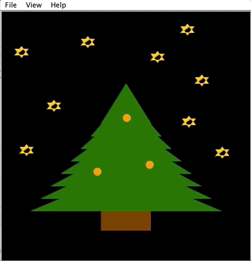

JavaGraphicsDrawing is a project that I made during my senior year of high school. It consists of a Christmas tree created
with Java Graphics featuring alternating lights (blue, orange, pink, and red) in time for the holiday season. 

   

